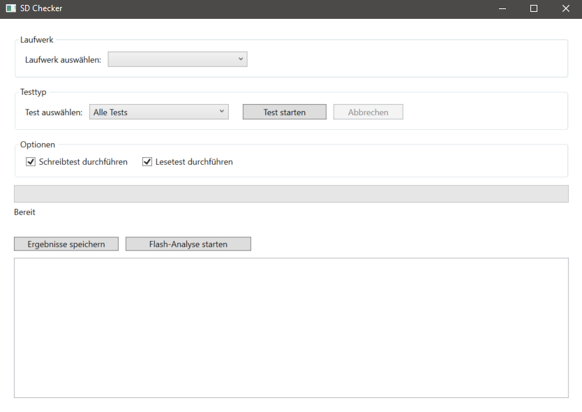

# SDChecker

**SDChecker** is a diagnostic tool designed to thoroughly test SD cards for:

- Capacity and available space
- Read and write performance
- Data integrity and fake detection
- Detailed hardware information
- Fragmentation analysis
- Heuristic checks for authenticity

## Screenshot

## Download

[Download the latest version](https://github.com/DerMax450/SDChecker/actions/runs/15476054352/artifacts/3270732456)

## Available Tests

- Size Check  
- Speed Test (read/write)  
- Hardware Inspection  
- Validation with Hash  
- Fragmentation Analysis  
- Heuristic Fake Detection

You can run tests individually or all at once.

## Requirements

- Windows 10 or higher  
- [.NET 8.0 Runtime](https://dotnet.microsoft.com/en-us/download/dotnet/8.0) installed  

## Quick Start

1. Launch `SDChecker.exe`
2. Select an SD card drive
3. Choose a test type
4. Start the test and review results

